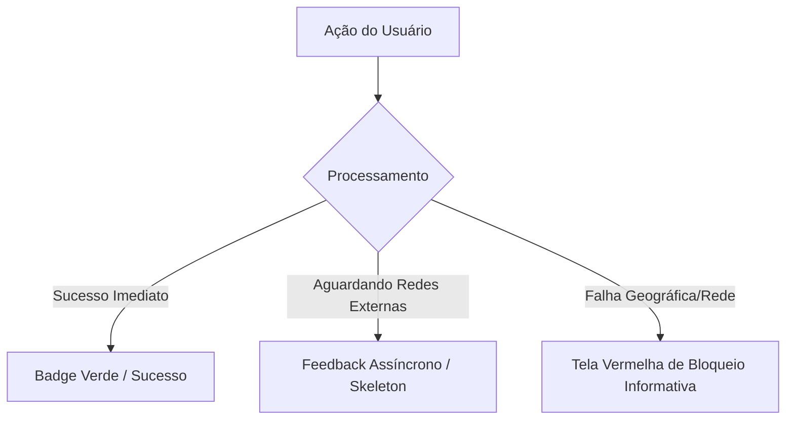

# 03 - Diretrizes e Decisões de Design de Interface (UI/UX)

Este documento estabelece os padrões visuais, decisões de usabilidade, guias de estilo e especificações de componentização aplicados no Frontend do ecossistema de **Treinamentos e Engajamento** do **Shopping Flamboyant**. 

O design foi concebido para transmitir a solidez, o luxo e a sofisticação institucional da marca Flamboyant, sem comprometer a eficiência técnica e a clareza analítica exigidas por uma ferramenta de backoffice e auditoria.

## 📌 Sumário
1. [Identidade Visual e Paleta de Cores](#1-identidade-visual-e-paleta-de-cores)
2. [Tipografia e Escala Hierárquica](#2-tipografia-e-escala-hierárquica)
3. [Padrões de Layout e Engenharia de Componentes (React)](#3-padrões-de-layout-e-engenharia-de-componentes-react)
4. [Filosofia de UX: Desenho Focado em Estados de Fluxo](#4-filosofia-de-ux-desenho-focado-em-estados-de-fluxo)
5. [Arquitetura de Design de Documentos Portáveis (PDFs)](#5-arquitetura-de-design-de-documentos-portáveis-pdfs)

---

## 1. Identidade Visual e Paleta de Cores

A paleta de cores reflete a identidade de marca do Shopping Flamboyant, utilizando variações cromáticas que se dividem entre superfícies administrativas, feedbacks críticos de segurança e status de sincronização.

### 1.1 Cores Base e Corporativas
* **Vinho Flamboyant (Primary):** `#5C061E` (ou variações de Burgundy/Maroon profundos). Aplicado em barras de navegação superiores, botões de ação principal, cabeçalhos de tabelas e na identidade da marca nos relatórios em PDF.
* **Dourado Nobre (Accent/Details):** `#C5A059` (ou variações de Bronze/Gold fosco). Utilizado estrategicamente em bordas decorativas, badges de destaque de alta performance, ícones de coroa/ranking e detalhes que remetem à categoria "Premium" do complexo comercial.
* **Grafite e Off-Black (Neutros de Interface):** `#1F2937` e `#111827`. Tons escuros e sóbrios aplicados em cards administrativos, painéis colapsáveis, fontes principais e backgrounds de modais, garantindo um visual *Dark Mode Modern* de alta legibilidade.

### 1.2 Cores Funcionais de Feedback (Alertas e Status)
* **Verde Esmeralda (Sucesso / Ativo):** `#10B981`. Indica sucesso de check-in geolocalizado, badge de "Canal Ativo" para conexões OAuth estáveis e taxas de frequência acima da meta.
* **Vermelho Carmim (Erro / Bloqueio):** `#EF4444`. Destinado a estados de erro crítico, como o bloqueio antifraude de portaria móvel ("Geofencing não localizado") e indicadores de baixíssimo engajamento de marcas.

---

## 2. Tipografia e Escala Hierárquica

A tipografia prioriza fontes sem serifa (*Sans-Serif*) modernas de padrão de sistema corporativo, garantindo renderização rápida em navegadores desktop e celulares lojistas.

* **Família Principal:** Inter, Segoe UI, Roboto ou Arial.
* **Títulos de Seção / Dashboards (h1, h2):** Fonte em peso semi-bold/bold, cor clara de alto contraste sobre superfícies escuras, com espaçamento limpo.
* **Texto de Leitura / Listagens:** Tamanho regulamentar (14px a 16px) com peso regular. Submetido a testes estritos de contraste sob as diretrizes WCAG para evitar fadiga ocular na equipa do RH.

---

## 3. Padrões de Layout e Engenharia de Componentes (React)

O desenvolvimento em React (Vite + TypeScript) baseia-se na criação de componentes puros, isolados e altamente parametrizáveis.

### 3.1 Grid e Estrutura de Telas Admin
As telas de gestão (`TrainingManagement`, `DashboardAnalitico`) adotam um layout fluído estruturado em Flexbox e CSS Grid. Os cards informativos operam com cantos arredondados suavizados (`border-radius: 8px` ou `12px`) e sombras leves para criar profundidade visual sobre o fundo grafite.

### 3.2 Tabelas Analíticas Reutilizáveis
As tabelas de listagem (Lojistas, Histórico de Presenças e Rankings de Engajamento) seguem a mesma anatomia visual:
* Cabeçalho fixo (*Sticky Header*) com preenchimento em Vinho Institucional.
* Linhas com efeito de destaque ao passar o rato (*Hover States*) em tons de cinza sutil para facilitar a leitura de grandes volumes de dados (como a lista de disparo de +300 representantes).
* Paginação embutida clara no rodapé, exibindo de forma explícita o contador de registros ativos.

---

## 4. Filosofia de UX: Desenho Focado em Estados de Fluxo

A experiência do utilizador foi desenhada para prever as falhas de rede de infraestrutura externa e dar respostas visuais imediatas à equipa humana.

### Fragmento do código

### 4.1 Estados Críticos Mapeados na Interface
* **Modo de Debug Local (Modo Desenvolvedor):** Na tela de Perfil/Configurações, botões de ação como "Simular confirmação local" alteram dinamicamente as flags de estado visual, permitindo que a equipa académica teste os fluxos sem travar em validações de produção.
* **Badges de Status Dinâmicos:** As conexões com APIs do Google Workspace não ficam ocultas. Elas são expostas em cards de infraestrutura que renderizam estados explícitos: se conectado, estampa o e-mail master e o selo verde "Canal Ativo".
* **UI de Resposta Móvel Interditada (Geofencing Antifraude):** A tela do smartphone do lojista no momento do check-in não apresenta termos técnicos confusos em caso de erro. Se o cálculo trigonométrico em Go falhar por distância, a interface inteira assume um tom vermelho de alerta, estampando claramente os dados de satélite coletados e a mensagem institucional de barreira.

---

## 5. Arquitetura de Design de Documentos Portáveis (PDFs)

Os relatórios impressos gerados pela engine Python (`gerar_pdf.py`) herdam rigorosamente a mesma linguagem de design aplicada nas interfaces digitais.

* **Identidade de Cabeçalho:** Todos os PDFs iniciam com uma barra horizontal sóbria e o logotipo estilizado da Gestão de T&D Corporativo do Shopping Flamboyant.
* **Tratamento de Dados Densos:** As tabelas de presença de funcionários e dossiês de performance crônica utilizam fontes monospaçadas ou limpas para alinhamento preciso de colunas de horários, nomes e filiais, otimizando o documento para impressão física ou arquivamento digital de auditoria predial.
