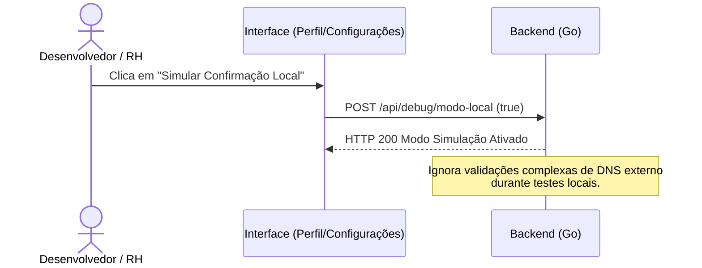
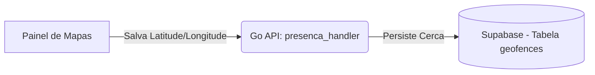
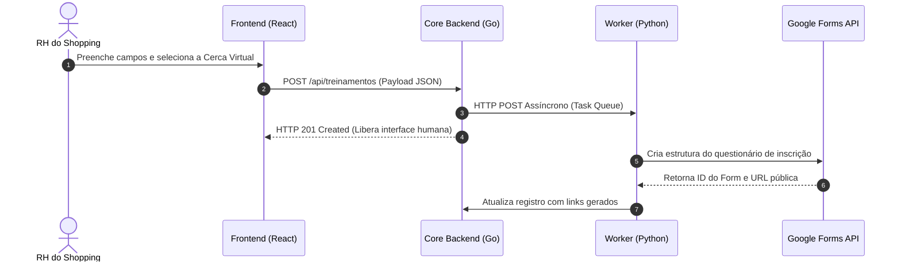
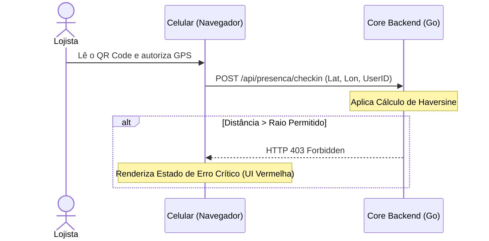
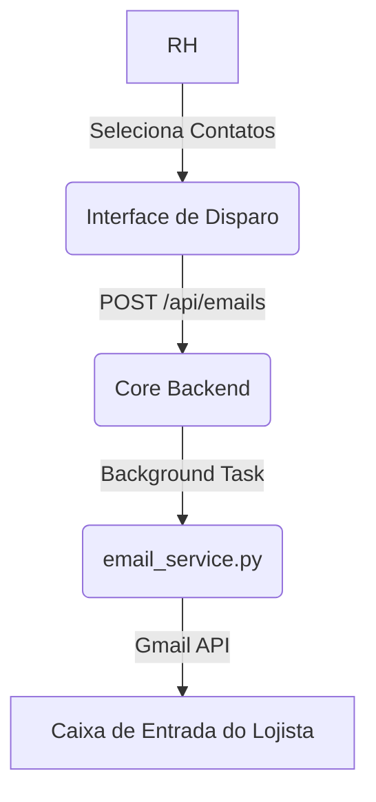
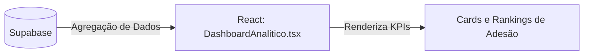

# 02. Mapeamento de Interfaces e Fluxos Detalhados

Esta seção vinculas as telas do protótipo aos componentes de codificação e fluxos de dados de background.

## 📌 Sumário
1. [Módulo 1: Perfil, Configurações e Infraestrutura de Testes](#módulo-1-perfil-configurações-e-infraestrutura-de-testes)
2. [Módulo 2: Parametrização e Configuração de Geofencing](#módulo-2-parametrização-e-configuração-de-geofencing)
3. [Módulo 3: Ciclo de Vida de Treinamentos e Geração de Links](#módulo-3-ciclo-de-vida-de-treinamentos-e-geração-de-links)
4. [Módulo 4: Portaria Digital e Validação Física (Check-In Móvel)](#módulo-4-portaria-digital-e-validação-física-check-in-móvel)
5. [Módulo 5: Disparo de Campanhas e Comunicação Transacional](#módulo-5-disparo-de-campanhas-e-comunicação-transacional)
6. [Módulo 6: Dashboard Analítico de Engajamento](#módulo-6-dashboard-analítico-de-engajamento)
7. [Módulo 7: Engine de Emissão de PDFs Corporativos](#módulo-7-engine-de-emissão-de-pdfs-corporativos)

---

## Módulo 1: Perfil, Configurações e Infraestrutura de Testes

Este módulo centraliza o painel de controle operacional do desenvolvedor e o status das conexões do ecossistema.

### Fragmento do código

### Detalhamento da Interface

* **Seção de Debug Técnico:** Contém controles contextuais explícitos para alternar estados da aplicação local em localhost, expondo os botões:
  * **"Simular confirmação local":** Ativa uma flag no Core Go para forçar bypass em validações externas de ambiente e agilizar testes unitários.
  * **"Desativar modo de teste local":** Retorna a API para o comportamento padrão de produção.
* **Card Google Connect API:** Exibe o status da ponte de dados com o Workspace. Quando o fluxo de autenticação via OAuth 2.0 é finalizado pelo `oauth_handler.go`, a interface exibe o badge "Canal Ativo" em tom verde junto à conta administradora vinculada.

---

## Módulo 2: Parametrização e Configuração de Geofencing

Módulo responsável por gerenciar os limites geográficos e as cercas virtuais utilizadas no controle antifraude de presença.

### Fragmento do código

### Detalhamento da Interface

* **Painel de Controle Geográfico:** Interface equipada com mapa interativo que lista os locais homologados do shopping e seus respectivos raios de tolerância.
* **Componentes de Entrada de Dados:** Formulário administrativo para inserção de:
  * **Nome do Local:** Identificação da sala ou praça.
  * **Latitude e Longitude:** Coordenadas decimais geográficas capturadas pelo ponto de âncora.
  * **Raio (Metros):** Definição da cerca métrica. Exemplos configurados: Centro de Aulas Aroeira (Restrição estrita de 150m) e Shopping Flamboyant Geral (Raio expandido de 300m).

---

## Módulo 3: Ciclo de Vida de Treinamentos e Geração de Links

Responsável pela criação de eventos de T&D e o acionamento automático de artefatos externos no Workspace de forma assíncrona.

### Fragmento do código

### Detalhamento da Interface

* **Formulário de Inclusão:** Recebe o Tema do treinamento (ex: Manejo Seguro de GLP e Redes de Gás), Facilitador, Data/Hora, Vagas Máximas, Segmento-Alvo e a seleção obrigatória da Cerca Virtual parametrizada.
* **Tabela de Listagem:** Lista os treinamentos com paginação indexada, contadores de registros cadastrados e a volumetria de vagas ocupadas.
* **Painel de Links e Ações:** Exibe os resultados finais do processamento do `forms_handler.py`:
  * **Link Externo do Google Forms:** Rota para o lojista responder à inscrição.
  * **Link de Auto-Presença:** Endereço dinâmico (`/autocheckin/[ID]`) associado ao QR Code projetado.

  
  
  
  
  
---

## Módulo 4: Portaria Digital e Validação Física (Check-In Móvel)

A portaria digital atua na captura e processamento da telemetria móvel para comprovação física de presença, mitigando marcações remotas.

### Fragmento do código

### Detalhamento da Interface

* **Interface Responsiva do Cliente:** Acionada pelo celular do funcionário. Invoca nativamente a API de localização do navegador (`navigator.geolocation`).
* **Estado de Erro Crítico:** Se o lojista efetuar a leitura fora da sala de treinamento, o algoritmo trigonométrico implementado no `presenca_handler.go` bloqueia o check-in e a tela exibe o erro em vermelho: *"Geofencing não localizado para este treinamento"*, expondo os metadados de satélite coletados para fins de auditoria.

---

## Módulo 5: Disparo de Campanhas e Comunicação Transacional

Interface de comunicação em massa integrada à API do Gmail para o envio automatizado de instruções e confirmações.

### Fragmento do código

### Detalhamento da Interface

* **Painel de Seleção Coletiva:** Tabela robusta com listagem e filtros de centenas de registros de lojistas e representantes habilitados para o treinamento, permitindo seleção individualizada ou disparo em massa.
* **E-mails Transacionais Emitidos (`email_service.py`):**
  * **E-mail de Convite:** Layout em HTML estruturado com a identidade do Shopping Flamboyant, contendo a data, hora, local, link direto do Google Forms para inscrição e link de portaria.
  * **E-mail de Confirmação:** Disparado automaticamente na caixa de entrada do lojista no segundo exato em que o check-in geolocalizado é validado pelo Go, servindo como recibo digital.

---

## Módulo 6: Dashboard Analítico de Engajamento

Central de inteligência de dados voltada para a governança e auditoria de conformidade das franquias do shopping.

### Fragmento do código

### Detalhamento da Interface

* **Cards de Indicadores Macro (KPIs):**
  * **Adesão Média das Lojas:** Métrica percentual geral de frequência do mall.
  * **Lojas Ativas:** Contagem volumétrica de marcas participantes das capacitações.
  * **Engajamento por Segmento:** Gráfico de barras comparativo que identifica a aderência por categoria de comércio (Alimentação, Vestuário, etc.).
* **Tabela de Conformidade por Loja:** Listagem consolidada que exibe a razão social da loja, categoria de mercado, taxa de frequência nominal e botões contextuais de ação direta para exportação do histórico.

---

## Módulo 7: Engine de Emissão de PDFs Corporativos

Serviço em Python (`gerar_pdf.py`) responsável por materializar dados estruturados do Supabase in relatórios portáveis de auditoria com formatação e identidade visual.

### 1. Lista de Chamada Oficial (Ata de Treinamento)
Documento analítico emitido por evento de treinamento, gerado sob demanda. Possui alto valor jurídico e de conformidade predial.

* **Cabeçalho e Metadados:** Consolida o Tema (Manejo Seguro de GLP e Redes de Gás), Facilitador (Eng. Roberto Dias), Data/Hora, Carga Horária (2 horas) e Local (Praça de Alimentação).
* **Indicadores de Controle:**
  * **Taxa Geral de Frequência:** Percentual de comparecimento em relação aos inscritos (ex: 85%).
  * **Auditoria de Vagas:** Contador absoluto de presença (ex: 34/40 Presentes vs. Capacidade Máxima).
* **Tabela de Evidências:** Listagem nominal detalhando Nome/Cargo do Representante, Franquia/Loja e o Horário exato do Check-In validado por satélite.

### 2. Dossiê de Performance Consolidado (Histórico por Loja)
Documento analítico temporal focado no rastreamento histórico de conformidade de uma franquia específica em relação às convocações do shopping.

* **Identificação da Unidade:** Exibe o Nome da Loja (ex: ANIMALE), Segmentação (Moda Feminina) e o Período Analisado (01/07/2025 até 31/12/2026).
* **Métrica de Performance:** Destaque visual centralizado indicando a Taxa Geral de Frequência da Loja (ex: 38%), expondo se a franquia cumpre ou negligencia as metas estabelecidas.
* **Histórico Nominal Crônico por Evento:** Tabela matricial detalhada contendo:
  * **Módulo Corporativo / Data:** Nome do treinamento e data de ocorrência.
  * **Representantes Presentes:** Nome do funcionário que validou o check-in físico.
  * **Ausentes ou Pendentes:** Identificação nominal clara dos funcionários convocados que faltaram ou deixaram o treinamento em pendência (ex: Natalia Werner, Tânia Santos Oliveira), fornecendo insumos diretos para cobranças contratuais ou operacionais por parte da administração do shopping.

[dossie_animale_2025-07-01_2026-12-31.pdf](https://github.com/user-attachments/files/28717125/dossie_animale_2025-07-01_2026-12-31.pdf)  
[lista_chamada_manejo_seguro_de_glp_e_redes_de_gás.pdf](https://github.com/user-attachments/files/28717154/lista_chamada_manejo_seguro_de_glp_e_redes_de_gas.pdf)

