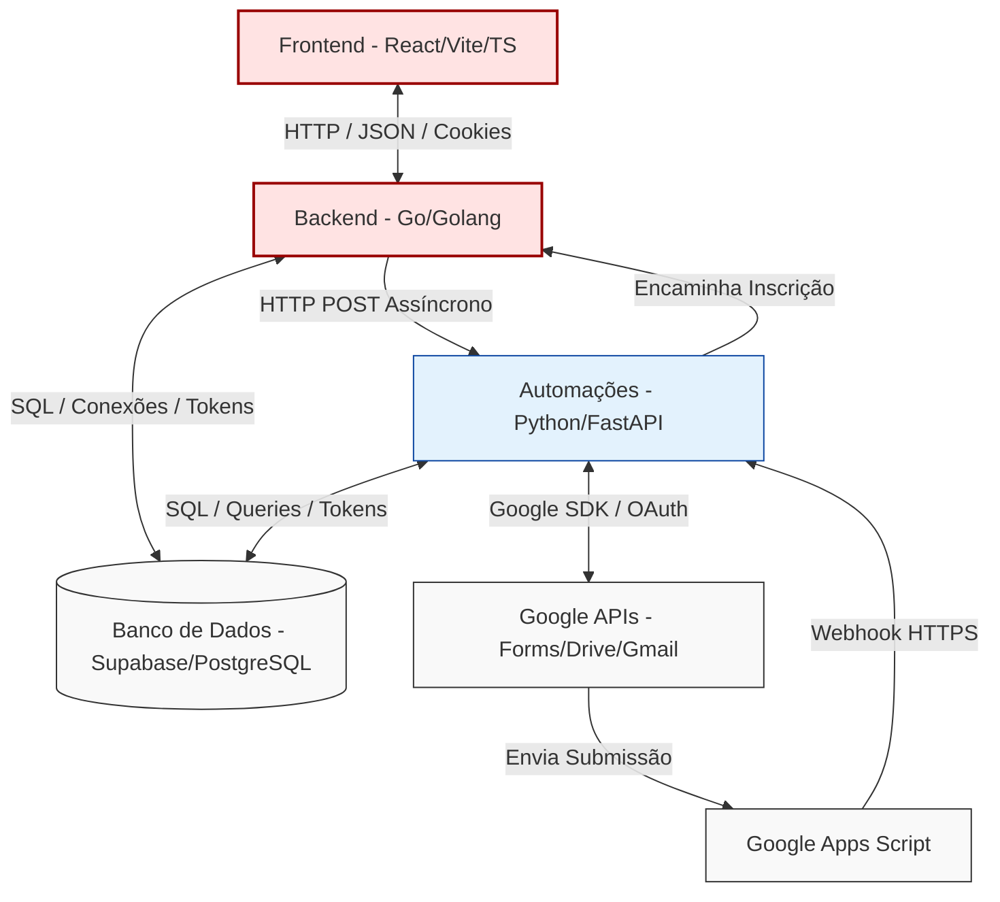

# 01. Visão Geral e Arquitetura do Sistema

Este documento detalha o desenho arquitetural, a topologia de componentes e o fluxo de dados do módulo de **Treinamentos e Engajamento** projetado para o ecossistema corporativo do **Shopping Flamboyant**. 

A solução adota o modelo de **Microsserviços Pragmáticos** utilizando uma abordagem poliglota. Esta decisão de design isola as tarefas de alta concorrência e criticidade operacional das rotas secundárias voltadas à automação de ferramentas de terceiros (Google API) e renderização assíncrona de arquivos de mídia/documentos.

---
## 1. Topologia de Componentes e Integrações

A arquitetura distribui-se em quatro camadas principais: Cliente (SPA/Mobile), Core Gateway (Go), Worker/Automation API (Python) e Infraestrutura de Dados (Supabase/Google Workspace).

### 1.1 Camada de Interface (Frontend)
Construída em React (Vite) com TypeScript, entrega uma aplicação SPA de alta fidelidade visual (com a identidade institucional do Shopping Flamboyant baseada em tons de vinho e dourado).
* **Painel Administrativo:** Permite o controle total do ciclo de vida de treinamentos, parametrização de cercas geográficas, importação massiva de lojistas via planilhas e visualização de dashboards analíticos de engajamento do mall.
* **Interface Cliente (Mobile-First):** Interface de portaria responsiva acionada exclusivamente por QR Code, projetada para capturar os dados de GPS do smartphone do lojista de forma transparente e segura no momento do check-in.

### 1.2 Camada de Orquestração e Negócio (Backend Core)
Desenvolvida em Go (Golang), atua como o gateway centralizador de segurança e persistência rápida.
* **Motivação da Escolha:** A concorrência nativa de Go (através de goroutines) garante vazão massiva de requisições simultâneas no milissegundo em que centenas de lojistas realizam o check-in síncrono na entrada das salas de aula.
* **Responsabilidades:** Validação trigonométrica de Geofencing, middleware global de segurança e tratamento de CORS, renovação criptografada de credenciais OAuth 2.0 e persistência direta via ORM/Driver nativo para o banco de dados.

### 1.3 Camada de Automação de Background (Worker API)
Desenvolvida em Python com FastAPI, projetada especificamente para execução de tarefas pesadas não-bloqueantes.
* **Motivação da Escolha:** Python possui o ecossistema mais maduro e performático para o consumo simplificado das APIs nativas do Google SDK (google-api-python-client) e manipulação matemática e gráfica de dados para PDFs complexos.
* **Responsabilidades:** Criação sob demanda de estruturas de formulários via Google Forms API, envio assíncrono de lotes de e-mails institucionais integrados ao Gmail do administrador e renderização dinâmica de Atas de Presença e Dossiês de Performance.

### 1.4 Camada de Dados e Serviços Serverless
* **Supabase / PostgreSQL:** Centraliza o modelo relacional de dados, tabelas de controle transacional (lojas, representantes, treinamentos, presencas) e chaves criptografadas de tokens.
* **Google Apps Script:** Componente serverless acoplado ao modelo base do Google Forms. Atua como um gatilho imediato de baixa latência (onFormSubmit) para despachar respostas em formato estruturado (JSON) via Webhook HTTPS diretamente para o microsserviço de automações.

## 2. Abordagem de Engenharia e Decisões de Design
### 2.1 Separação de Preocupações (SoC) e Assincronismo
Para otimizar o tempo de resposta percebido pelo usuário administrativo, o sistema delega chamadas demoradas de rede para filas de processamento em segundo plano (BackgroundTasks do FastAPI).
Quando o RH clica em "Criar Treinamento", o backend em Go imediatamente registra a entidade no Supabase e responde HTTP 201 Created para o Frontend. O processo paralelo de requisição junto à API do Google Drive para criar a pasta corporativa, estruturar as perguntas do Google Form e capturar o ID de retorno ocorre de forma assíncrona em background na camada Python, sem travar a interface humana.

### 2.2 Terceirização Inteligente de UI via Google Workspace
Em vez de alocar centenas de horas de desenvolvimento na criação de um motor interno e dinâmico de formulários/questionários (o que exigiria uma modelagem de dados complexa de perguntas, respostas, tipos de inputs e validações), o ecossistema externaliza a coleta de inscrições para o Google Forms.
Essa estratégia de design reduz drasticamente a carga de infraestrutura do sistema, garante conformidade nativa com dispositivos móveis e aproveita a infraestrutura global do Google para aguentar picos de tráfego de respostas.

### 2.3 Modo de Depuração e Simulação Local
Visando otimizar a esteira de desenvolvimento e testes de integração do time acadêmico sem a necessidade de deploys em nuvem a cada alteração, o backend em Go foi implementado com flag-switches globais de ambiente. O sistema expõe nativamente rotas de bypass como "Simular confirmação local" e "Desativar modo de teste local", isolando comportamentos de validação de rede externa durante baterias de testes em ambientes locais de localhost.

## 3. Matriz de Comunicação entre Componentes

| Origem | Destino | Protocolo / Formato | Descrição do Fluxo |
| :--- | :--- | :--- | :--- |
| Frontend (React) | Backend Core (Go) | HTTP / JSON / Cookies | Chamadas de CRUD administrativos e envio de coordenadas de GPS para check-in. |
| Backend Core (Go) | Automações (Python) | HTTP POST / JSON | Solicitações de disparo de e-mails em lote e ordens de geração de novos formulários. |
| Google Apps Script | Automações (Python) | Webhook HTTPS / JSON | Disparo imediato contendo a carga de dados assim que um lojista finaliza um formulário. |
| Automações (Python) | Backend Core (Go) | HTTP POST / JSON | Encaminha dados limpos e validados de novas inscrições para persistência no Core. |
| Serviços (Go / Python) | Banco de Dados (Supabase) | TCP/IP / SQL Nativo | Conexões persistentes para leitura e escrita estruturada do modelo de dados. |
